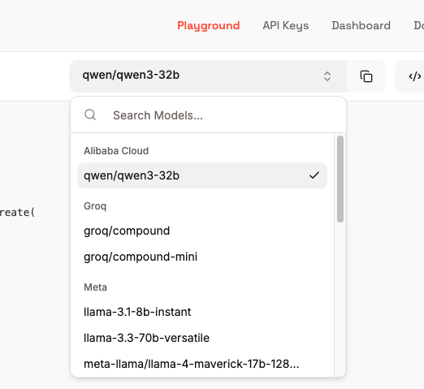

# Practica benchmark

En esta práctica se desarrollará un benchmark para poder evaluar el rendimiento de un modelo en ciertas tareas. Se proporciona un jupyter notebook con el código y un par de ejemplos de preguntas tipo test. El alumno debe adaptar el código para ejecutar un nuevo benchmark incluido en el fichero excel: `practica_benchmark_preguntas.xlsx` 

- Recuerda que puedes importar y ejecutar el notebook desde google colab https://colab.research.google.com/

- Si los modelos a usar ya están deprecados, seleccione modelos de groq disponibles:
   

